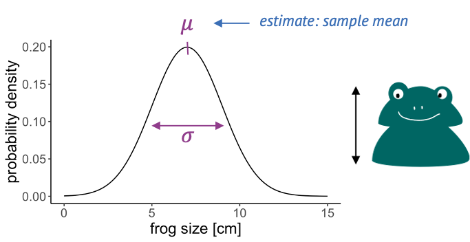

```{r results='hide'}
library(tidyverse)
```

By the end of this second interactive tutorial you will be able to:

-   describe what sampling and probability distributions are
-   list some common distributions of biological data
-   visualize the distribution of your data in R
-   pick a suitable distribution to model your data with

Before starting this tutorial, we recommend you complete the first tutorial on data handling and visualization or have basic knowledge or R and the tidyverse.

## The binomial distribution

Before we look at more distributions, let's get some hands-on experience in R! R knows a whole range of distributions: (Here)[<https://stat.ethz.ch/R-manual/R-devel/library/stats/html/Distributions.html>] is a list of them.

For each distribution, R has four different function calls: For the binomial distribution, these all end with `binom`: * `dbinom`: density * `pbinom`: cumulative distribution function (percentage of values smaller than) * `qbinom`: quantile function (inverse of cumulative distribution) * `rbinom`: generates random numbers

The first letter specifies if we want to look at the density, probability distribution/mass function, quantile or random numbers. The suffix specifies the distribution.

The arguments depend on the distribution we are looking at, but always include the parameters of that function.

**Calculating probabilities:** Let's use the example where we caught 10 frogs and count how many of them are light-colored.

For known parameters, we can calculate the the chances of counting exactly 5 light-colored frogs:

```{r}
n = 10 # number of frogs we catch
p = 0.3 # true fraction of light frogs
dbinom(x=5, size=n, prob=p)
```

We can ask for the probability of catching at most (or at least) 5 light frogs. In this case, we need the cumulative probability distribution starting with `p`:

```{r}
pbinom(q=5, size=n, prob=p) # at most
```

```{r}
pbinom(q=5, size=n,prob=p, lower.tail=FALSE) # larger than
```

Catching at least 5 light frogs is a rare event.

**Exercise:** There is a disease with a known prevalence of 4%. You have a group of 100 randomly selected persons. Use the above functions to calculate the probability of seeing exactly 7 persons with the disease.

```{r}
n = 100 # number of frogs we catch
p = 0.04 # true fraction of light frogs
dbinom(x=7, size=n, prob=p)
```

**Exercise:** Use the above functions to calculate the probability of seeing at least 7 persons with the disease.

```{r}
pbinom(q=6, size=100, prob=.04, lower.tail=FALSE)
```

## The Poisson distribution

Here's a short interlude on random numbers in R, which you can use to simulate your own data. This can be very useful to set up toy models and see what the data or certain plots would look like in theory.

For example, we could simulate frog counts from 100 binomial experiments, that is the counts of light colored frogs from filling a net one hundred times:

```{r}
set.seed(85)
size = 10 # number of frogs per net
prob = 0.3 # true percentage of light colored frogs
n = 100 # number of binomial experiments
binomial_frog_counts <- rbinom(n=n, size=size, prob=prob)
head(binomial_frog_counts)
```

Here, we used `set.seed()` for reproducibility: The seed gives an initialization to the process of drawing random numbers. So any time we run the same simulation with the same seed, we will get the same random numbers. If we don't set the seed, the random numbers will look different each time we run the code.

**Exercise:** Try the same with Poisson random numbers: Simulate 100 random frog counts with a Poisson rate of 4.

```{r}
set.seed(81)
size = 10 # number of frogs per net
prob = 0.4 # true percentage of light colored frogs
n = 100 # number of binomial experiments
binomial_frog_counts <- rbinom(n=n, size=size, prob=prob)
head(binomial_frog_counts)
```

**Exercise:** Now run the same simulation again and calculate the mean frog count:

```{r}
rpois(n = 200, lambda = 4) %>% 
  mean()
```

## The Gamma Poisson distribution in R

The Gamma Poisson distribution goes by two names: "Gamma Poisson" or "negative binomial". In R, its suffix is `nbinom.` To make things more confusing, the Gamma Poisson can be parametrized in different ways. This means, it is possible to describe the same distribution with different combinations of parameters.

In the (video lecture)[<https://shiny-portal.embl.de/shinyapps/app/03_csda_tutorial_2>], I introduced a parametrization with

* mean μ (the average Poisson rate) and
* scale θ (a measure for how much the Poisson rate varies between individual counts),

because I find it most intuitive. The argument `mu` in `dnbinom` lets you define μ. The argument `size` is the inverse of θ, that is for a small size you will get a distribution with a large overdispersion (=spread). For very large values of `size`, the distribution will tend towards a Poisson distribution.

Note: Consult the "Details" in the help function (`help(dnbinom)`) if you choose to parametrize in a different way.

**Exercise:** To demonstrate how the Gamma Poisson distribution differs from a Poisson, let's compare the means and variances.

**Poisson mean:** Simulate 100 random frog counts with a Poisson rate of 4 then calculate the mean:

```{r}
rpois(n=100, lambda = 4) %>% 
  mean()
```

**Poisson variance:** Simulate 100 random frog counts with a Poisson rate of 4, then calculate the variance using the function **var**:

```{r}
rpois(n=100, lambda = 4) %>% 
  var()
```

**Gamma Poisson mean:** Simulate 100 random frog counts from different lakes with a mean 4 and size=2, then calculate the mean:

```{r}
rnbinom(n=100, mu=4, size=2) %>% 
  mean()
```

**Gamma Poisson variance:** Simulate 100 random frog counts from different lakes with a mean of 4 and size=2, then calculate the variance using the function var:

```{r}
rnbinom(n=100, mu=4, size=2) %>% 
  var()
```

## The Gaussian distribution

We covered the Gaussian – also known as Normal distribution earlier in this tutorial as an example, and you have most likely come across it before.

It is applicable to repeated measurements of the same thing, for example

* frog lengths,
* temperatures or
* pixel intensities.



The Gaussian distribution is continuous and has two parameters:

* the mean, which is estimated by the sample mean, and
* the variance, which is estimated by the sample variance.

## Tools for visually comparing distributions

Usually, we have some data and want to find the "right" distribution for it. That means, we want to find a distribution that models the data in a suitable way. The workflow should look something like this:

1. Fit your data to a distribution that you consider plausible. We’ll see how to do this in R. The fit will give you the best parameters for this distribution, given your data.
2. Visually compare the theory to your data points. The theory in this case is the fit you just obtained. In the visualization, a good fit doesn’t show systematic deviations of the data points from theory.
3. Do the same with other plausible distributions.
4. Decide which fit looks best to you.

### A note on fitting

When we say we “fit” a distribution, we are usually talking about the maximum likelihood approach. This means we find the parameters for which it is most likely to see the given data. This is an optimization problem - and thus can be solved conveniently by the computer. You might also hear people say they minimize the deviance when they fit data, and this is just another term for minimizing the distance between the line (theory) and the points (data). The exact mathematical formula for the deviance to be minimized depends on the type of distribution we are fitting to – for example, when fitting a Gaussian distribution, we minimize the sum of squares. But no worries: The tools for fitting that you’ll get to know in this tutorial know their formulae :)

## Histograms

For demonstration, let's simulate frog counts and sizes with random draws from a Poisson and a Gaussian distribution. This code should by now look familiar to you:

```{r}
set.seed(51) # set a seed for reproducibility
frog_counts <-rpois(n = 200, lambda = 4)
frog_sizes <- rnorm(n = 200, mean = 7, sd = 2)
frog_counts_different_lakes <- rnbinom(n=200, size=2, mu=4)
```

We can then use `ggplot2` to plot histograms from the simulations. The histogram will have a shape that is specific for the distribution:

```{r}
data.frame(frog_counts) %>% 
  ggplot(aes(x=frog_counts)) +
  geom_histogram(binwidth=1)
```

```{r}
data.frame(frog_sizes) %>% 
  ggplot(aes(x=frog_sizes))+
  geom_histogram()
```

**Exercise:** Note how I used binwidth=1 for displaying the count data. Try what happens if you don’t:

```{r}
data.frame(frog_sizes) %>% 
  ggplot(aes(x=frog_sizes)) +
  geom_histogram(binwidth = 1)
```

### Relation between histogram and distribution function

The theoretical distribution gives the expected frequency of the random numbers.

For example for the Poisson frog counts, we can calculate the expected frequency of the counts from 0 to 20:

```{r}
counts <- 0:20
expected_freq <- dpois(counts, lambda = 4) * length(frog_counts)
```

Then we can plot the expected counts as a line on top of the histogram:

```{r}
data.frame(frog_counts) %>% 
  ggplot(aes(x=frog_counts)) +
  geom_histogram(binwidth=1) +
  geom_line(data=data.frame(counts,expected_freq), aes(counts,expected_freq))
```

### The goodfit function

You might not want to code this plot every time you visually inspect a fit. Luckily, there are convenient functions that do this for you.

The `goodfit` function from the `vcd` package allows you to fit a sample to a discrete distribution of interest.
Here, we fit the frog counts to a Poisson:

```{r}
# install.packages("vcd")
library(vcd)
my_fit <- goodfit(frog_counts, "poisson")
my_fit$par
```

```{r}
plot(my_fit)
```

This is how a good fit looks like: The bars all roughly stop at zero, some above and some below, which is due to the sample's randomness.

**Exercise:** Use the goodfit function to fit the frog_counts_different_lakes data with a Poisson.

```{r}
my_fit <- goodfit(frog_counts_different_lakes, "poisson")
my_fit$par
plot(my_fit)
```


This histogram should show you that there is a systematic problem: The bars at the periphery hang very low and those around the peaks hang high. This indicates that the fit isn’t too good.

**Exercise:** Fit the frog counts from different lakes with a Gamma-Poisson distribution instead (hint: in the goodfit function, it is called nbinomial). Can you make out the visual difference between a good and a bad fit?

```{r}
my_fit <- goodfit(frog_counts_different_lakes, "poisson")
my_fit$par
plot(my_fit)
```

## The cumulative distribution function

The cumulative distribution is the integral of the distribution, and thus the empirical cumulative distribution is the integral of the histogram. It gives you the percentage of values that are smaller than a certain value.
We can visualize it with `stat_ecdf` in `ggplot2`.

```{r}
data.frame(frog_sizes) %>% 
  ggplot(aes(x=frog_sizes)) +
  stat_ecdf() # empirical cumulative distribution function
```

As for the histogram, you could calculate the expected values for the cumulative distribution and add them to the plot:

```{r}
sizes <- seq(0, 14, .5)
theoretical_cdf <- pnorm(sizes, mean=7, sd=2)

data.frame(frog_sizes) %>% 
  ggplot(aes(frog_sizes)) +
  stat_ecdf() +
  geom_line(data=data.frame(sizes, theoretical_cdf),
            aes(sizes, theoretical_cdf), colour="green")
```

Off this plot you can read for a frog size of x (e.g. 7cm), that about 50% of the values are smaller than this value. So this is really just another way to display the histogram.

## The QQ-plot

The qq-plot compares the quantiles of two distributions.

Quantiles are the inverse of the cumulative distribution, i.e., the `qnorm` function is the inverse of `pnorm`:

You can use `pnorm` to ask for the probability of seeing a value of `−2` or smaller:

```{r}
pnorm(q = -2,mean=0, sd=2)
```

Then you can use qnorm to ask that is the value for which 15% of the other values are smaller. Here, I demonstrate this by plugging the result into the pnorm function into the qnorm function:

```{r}
qnorm(p= pnorm(q = -2,mean=0, sd=2), mean=0, sd=2)
```

Let’s compare the quantiles of the simulated frog sizes to the theoretical quantiles of a normal distribution. There are specialized functions for qq-plots, so we don't have to calculate the theoretical values by hand:

```{r}
data.frame(frog_sizes) %>% 
  ggplot(aes(sample=frog_sizes)) +
  geom_qq() +
  geom_qq_line()
```

By default, the `geom_qq` function assumes that we compare to a standard normal distribution.

This fit doesn't look too bad, although for low values the points stray away from the line. This shouldn't surprise you, because remember: The normal distribution approximates the Poisson distribution (with which the simulation was generated) well for large values, but has limitations for low-valued counts.

Let's set up a qq-plot where we compare to a Poisson distribution:

```{r}
data.frame(frog_counts) %>% 
  ggplot(aes(sample=frog_counts))+
  geom_qq(distribution=qpois, dparams=list(lambda=mean(frog_counts)))+
  geom_abline()
```

This fit looks better. We can still argue whether a qq-plot is the best representation for a Poisson fit, because due to the distribution’s discreteness, many data points end up on the exact same spot in the plot (overplotting). Thus, we loose information in this visualization.

## One fits all - fitdistrplus package

If you want a quick overview, you can use the fitdistrplus package, which produces a series of plots.

Suppose you fit the frog counts to a normal distribution:

```{r}
# install.packages("fitdistrplus")
library(fitdistrplus)
my_fit <- fitdist(frog_counts, dist = "norm")
my_fit # gives you the parameter estimates
```

```{r}
plot(my_fit)
```

With some practice, this plot quickly allows you to see that you are comparing discrete data to a continuous distribution. Also, the QQ-plot doesn't really give a straight line and the histogram seems to be skewed to the left, compared to theory.

**Exercise:** What does it look like if you fit the frog_counts to a Poisson instead?

```{r}
library(fitdistrplus)
my_fit <- fitdist(frog_counts, dist = "pois")
plot(my_fit)
```


